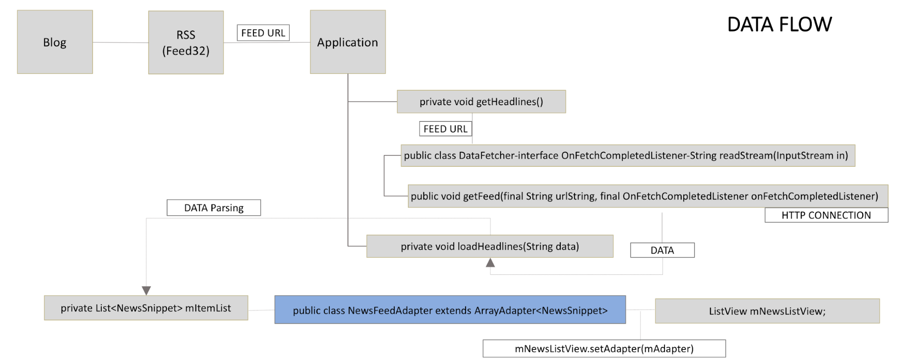
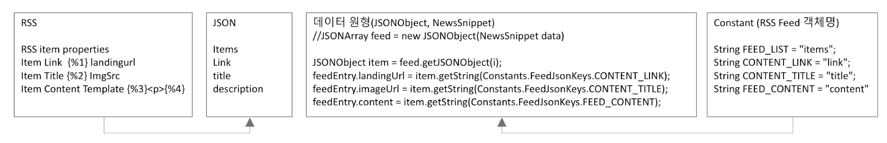
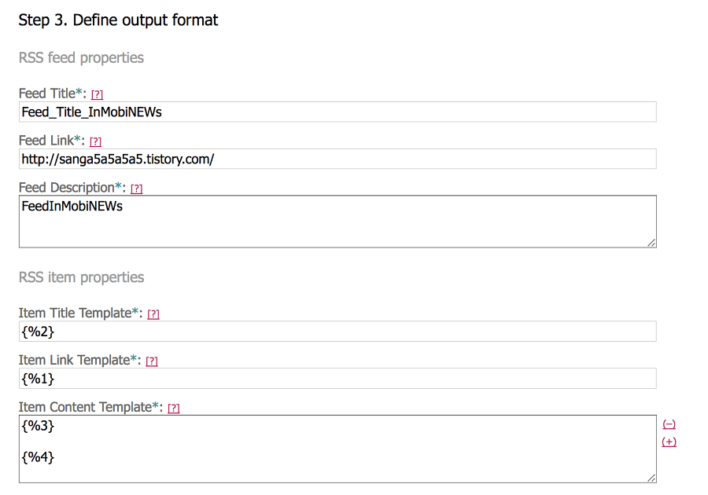
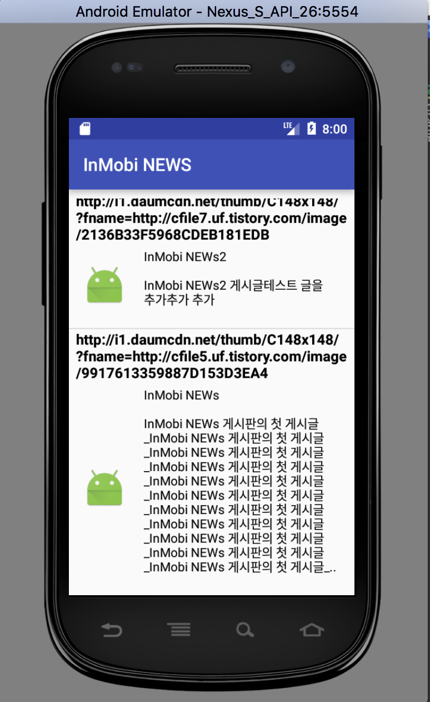

# sdk-sample-code-android-rss
<html>
   <head>
      <meta content="text/html; charset=UTF-8" http-equiv="content-type">
   </head>
   <body class="c10">
      
RSS &#54588;&#46300;&#47484; &#54876;&#50857;&#54620; article collection &#49368;&#54540;&#50545;

      
1. &#44060;&#50836;

      
&#50504;&#46300;&#47196;&#51060;&#46300; &#54532;&#47196;&#44536;&#47000;&#48141; &#50616;&#50612;&#47484; &#54876;&#50857;&#54620; &#44592;&#49324; &#47785;&#47197; &#50528;&#54540;&#47532;&#52992;&#51060;&#49496;&#51032; &#50500;&#53412;&#53581;&#52376;&#51060;&#45796;. &#48660;&#47196;&#44536;&#50640; &#51080;&#45716; &#44592;&#49324; &#44544;&#51012; &nbsp;RSS Feed&#47196; &#48320;&#54872;&#54616;&#44256; xml&#54028;&#51068; &#54805;&#53468;&#47196; &#51204;&#49569;&#46108; RSS Fedd &#45936;&#51060;&#53552;&#47484; &#50528;&#54540;&#47532;&#52992;&#51060;&#49496;&#50640;&#49436; &#48155;&#50500; &#44592;&#49324;&#47484; &#51060;&#47336;&#45716; &#44396;&#49457; &#50836;&#49548;(ex. &#51228;&#47785;, &#51060;&#48120;&#51648; &#54028;&#51068;, &#44592;&#49324;&#48376;&#47928;)&#50640; &#47582;&#44172; &#54028;&#49905;&#54616;&#50668;(parsing) ListView&#44032; &#49373;&#49457;/&#44081;&#49888; &#46112; &#46412; &#54868;&#47732;&#50640; &#48372;&#50668;&#51456;&#45796;. &#44305;&#44256; SDK(InMobi)&#47484; &#50672;&#46041;&#54616;&#50668; &#53945;&#51221; &#51060;&#48292;&#53944;(webView &#54840;&#52636;) &#48156;&#49373;&#49884; &#51204;&#47732; &#48176;&#45320;&#47484; &#46916;&#50864;&#44256; &#52376;&#51020; &#50545;&#51060; &#49884;&#51089;&#46104;&#50632;&#51012; &#46412;&#45716; &#46944;&#48176;&#45320;&#47484; &#54868;&#47732; &#54616;&#45800;&#50640; &#48176;&#52824;&#54616;&#50668; &#44305;&#44256; &#49688;&#51061;&#54868;&#47484; &#50948;&#54620; &#50672;&#46041; &#46608;&#54620; &#49444;&#47749;&#54620;&#45796;. &#44305;&#44256; SDK&#45716; InMobi Android 6.2.0&#47484; &#54876;&#50857;&#54616;&#50688;&#45796;.

      
2. Data &#44396;&#49457; &#48143; &#55120;&#47492;

      
&#48660;&#47196;&#44536;, RSS Feed, Application &#49464; &#44396;&#44036;&#50640;&#49436; &#49324;&#50857;&#46104;&#45716; &#45936;&#51060;&#53552;&#50752; &#45936;&#51060;&#53552; &#55120;&#47492;

      
2-1. Data &#44396;&#49457;

      
1) &#45936;&#51060;&#53552; &#50896;&#54805;NewsSnippet &nbsp;&#51221;&#51032; &nbsp;2) &#45936;&#51060;&#53552; &#50896;&#54805;&#51012; &#51088;&#47308;&#54805;&#51004;&#47196; &#47532;&#49828;&#53944; private List&lt;NewsSnippet&gt;&#47484; &#49440;&#50616; 3) &#44592;&#49324; &#47785;&#47197;&#51012; &#48372;&#50668;&#51460; ListVie &#49440;&#50616; 4) List&lt;NewsSnippet&gt;&#50752; ListView&#45716; &#49324;&#50857;&#51088;&#51221;&#51032; Adapter&#47196; &#50672;&#44208; 5) getView()&#54632;&#49688;(ListView&#51032; &#54637;&#47785;&#51060; &#49324;&#50857;&#51088; &#54868;&#47732;&#50640; &#44081;&#49888;&#46112; &#46412;&#47560;&#45796; &#54840;&#52636;&#46104;&#45716; &#54632;&#49688;)&#44032; &#54840;&#52636;&#46112; &#46412;&#47560;&#45796; &#54644;&#45817; Adapter&#47484; &#53685;&#54644; List&lt;NewsSnippet&gt;&#51032; &#45936;&#51060;&#53552;&#44032; ListView&#50640; &#44081;&#49888;&#46112; &#49688; &#51080;&#46020;&#47197; &#49444;&#51221;&#54620;&#45796;.

      
2-2. Data Flow 

      
1) &#48660;&#47196;&#44536;&#50640; &#44592;&#49324;&#47484; &#51089;&#49457; 2) &#48660;&#47196;&#44536;&#51032; &#44592;&#49324;&#47484; RSS Feed&#47196; &#49373;&#49457; 3) RSS Feed URL &#48156;&#44553;, &#50528;&#54540;&#47532;&#52992;&#51060;&#49496;&#50640;&#49436; &#54644;&#45817; URL&#51012; &#51200;&#51109; 4) URL&#51012; &#44032;&#51648;&#44256; HTTP Connection&#51012; &#47610;&#44256; RSS Feed Data&#47484; Fetc 5) Fetch &#46108; &#45936;&#51060;&#53552;&#45716; Json &#54805;&#53468;&#50640; &#47582;&#44172; Parsing 6) &#50896;&#54805; &#45936;&#51060;&#53552;(NewsSnippet)&#50640; &#51200;&#51109;&#54616;&#45716; &#44284;&#51221;&#51012; &#44144;&#52828;&#45796;.

      

      

      

      
Fig1. class &#44288;&#44228;&#47196; &#48376; Data&#51032; &#55120;&#47492;

      

      

      

      
Fig2. RSS Feed - Json&#44061;&#52404; Fetch/Store

      

      
2-3. RSS Feed &#49373;&#49457;

      
Feed43&#51012; &#54876;&#50857;&#54616;&#50668; XML &#54805;&#49885;&#51032; Feed&#47484; &#49373;&#49457;&#54620;&#45796;. http://feed43.com &#50640;&#49436; HTML &#54168;&#51060;&#51648;&#50640;&#49436; &#54056;&#53556;(Extraction Rules : {*}&#45716; &#47784;&#46304; &#48512;&#48516;, &quot;{*}class=&quot;{*}&quot;&gt;

      
&lt;img src=&quot;&lt;/strong&gt;{*}

      
&lt;p class=&quot;txt_post&quot;&gt;{%}&lt;/p&gt;{*}

      
&lt;/a&gt;{*}

      
&lt;/div&gt;

      
Fig3. Feed43 &#50577;&#49885; &#51089;&#49457;

      
2-4. Data Fetch : RSS Feed to Application

      
Step A. HttpURLConnection with URL Step C. inputstream = BufferedInputStream with B &nbsp; Step D. readStream with inputstream which step C returns  Step E. Returns data which is prototype of RSS feed

      
Fetch&#54620; &#45936;&#51060;&#53552;&#45716; UTF-8&#47196; &#51064;&#53076;&#46377;&#46104;&#50612;&#51080;&#44256; &#44208;&#44284;&#45716; &#50500;&#47000;&#50752; &#44057;&#45796;.

      
11-25 09:48:05.710 2978-3132/com.inmobi.banner.sample D/This&nbsp;is&nbsp;data&nbsp;:: {&quot;status&quot;:&quot;ok&quot;,&quot;feed&quot;:{&quot;url&quot;:&quot;http:\/\/feed43.com\/1801458831546005.xml&quot;,&quot;title&quot;:&quot;Feed_Title_InMobiNEWs&quot;,&quot;link&quot;:&quot;http:\/\/sanga5a5a5a5.tistory.com\/&quot;,&quot;author&quot;:&quot;&quot;,&quot;description&quot;:&quot;FeedInMobiNEWs&quot;,&quot;image&quot;:&quot;&quot;},&quot;items&quot;:[{&quot;title&quot;:&quot;http:\/\/i1.daumcdn.net\/thumb\/C148x148\/?fname=http:\/\/cfile27.uf.tistory.com\/image\/99D2CB3359887E1C06B816&quot;,&quot;pubDate&quot;:&quot;2017-11-24 12:49:15&quot;,&quot;link&quot;:&quot;http:\/\/sanga5a5a5a5.tistory.com\/4&quot;,&quot;guid&quot;:&quot;d619ff6c5891ddb3f3ecee4292a6b359&quot;,&quot;author&quot;:&quot;&quot;,&quot;thumbnail&quot;:&quot;&quot;,&quot;description&quot;:&quot;\ud14c\uc2a4\ud2b8 3\ubc88 \uc2ec\uc2ec\uc774\n\n\uc2ec\uc2ec\uc774 \ud14c\uc2a4\ud2b8 3\ubc88 \uae00\uc785\ub2c8\ub2e4.&lt;p&gt;&lt;sub&gt;&lt;i&gt;-- Delivered by &lt;a href=\&quot;http:\/\/feed43.com\/\&quot;&gt;Feed43&lt;\/a&gt; service&lt;\/i&gt;&lt;\/sub&gt;&lt;\/p&gt;\n&quot;,&quot;content&quot;:&quot;\ud14c\uc2a4\ud2b8 3\ubc88 \uc2ec\uc2ec\uc774\n\n\uc2ec\uc2ec\uc774 \ud14c\uc2a4\ud2b8 3\ubc88 \uae00\uc785\ub2c8\ub2e4.&lt;p&gt;&lt;sub&gt;&lt;i&gt;-- Delivered by &lt;a href=\&quot;http:\/\/feed43.com\/\&quot;&gt;Feed43&lt;\/a&gt; service&lt;\/i&gt;&lt;\/sub&gt;&lt;\/p&gt;\n&quot;,&quot;enclosure&quot;:[],&quot;categories&quot;:[]},{&quot;title&quot;:&quot;http:\/\/i1.daumcdn.net\/thumb\/C148x148\/?fname=http:\/\/cfile7.uf.tistory.com\/image\/2136B33F5968CDEB181EDB&quot;,&quot;pubDate&quot;:&quot;2017-11-24 12:49:14&quot;,&quot;link&quot;:&quot;http:\/\/sanga5a5a5a5.tistory.com\/3&quot;,&quot;guid&quot;:&quot;8c460a004b47bd0503edaad76f1df2ca&quot;,&quot;author&quot;:&quot;&quot;,&quot;thumbnail&quot;:&quot;&quot;,&quot;description&quot;:&quot;InMobi NEWs2\n\nInMobi NEWs2 \uac8c\uc2dc\uae00\ud14c\uc2a4\ud2b8 \uae00\uc744 \ucd94\uac00\ucd94\uac00 \ucd94\uac00&lt;p&gt;&lt;sub&gt;&lt;i&gt;-- Delivered by &lt;a href=\&quot;http:\/\/feed43.com\/\&quot;&gt;Feed43&lt;\/a&gt; service&lt;\/i&gt;&lt;\/sub&gt;&lt;\/p&gt;\n&quot;,&quot;content&quot;:&quot;InMobi NEWs2\n\nInMobi NEWs2 \uac8c\uc2dc\uae00\ud14c\uc2a4\ud2b8 \uae00\uc744 \ucd94\uac00\ucd94\uac00 \ucd94\uac00&lt;p&gt;&lt;sub&gt;&lt;i&gt;-- Delivered by &lt;a href=\&quot;http:\/\/feed43.com\/\&quot;&gt;Feed43&lt;\/a&gt; service&lt;\/i&gt;&lt;\/sub&gt;&lt;\/p&gt;\n&quot;,&quot;enclosure&quot;:[],&quot;categories&quot;:[]},{&quot;title&quot;:&quot;http:\/\/i1.daumcdn.net\/thumb\/C148x148\/?fname=http:\/\/cfile5.uf.tistory.com\/image\/9917613359887D153D3EA4&quot;,&quot;pubDate&quot;:&quot;2017-11-24 12:49:13&quot;,&quot;link&quot;:&quot;http:\/\/sanga5a5a5a5.tistory.com\/2&quot;,&quot;guid&quot;:&quot;5766d61959d4ea5a89b480b6a7ad5642&quot;,&quot;author&quot;:&quot;&quot;,&quot;thumbnail&quot;:&quot;&quot;,&quot;description&quot;:&quot;InMobi NEWs\n\nInMobi NEWs \uac8c\uc2dc\ud310\uc758 \uccab \uac8c\uc2dc\uae00_InMobi NEWs \uac8c\uc2dc\ud310\uc758 \uccab \uac8c\uc2dc\uae00_InMobi NEWs \uac8c\uc2dc\ud310\uc758 \uccab \uac8c\uc2dc\uae00_InMobi NEWs \uac8c\uc2dc\ud310\uc758 \uccab \uac8c\uc2dc\uae00_InMobi NEWs \uac8c\uc2dc\ud310\uc758 \uccab \uac8c\uc2dc\uae00_InMobi NEWs \uac8c\uc2dc\ud310\uc758 \uccab \uac8c\uc2dc\uae00_InMobi NEWs \uac8c\uc2dc\ud310\uc758 \uccab \uac8c\uc2dc\uae00_InMobi NEWs \uac8c\uc2dc\ud310\uc758 \uccab \uac8c\uc2dc\uae00_InMobi NEWs \uac8c\uc2dc\ud310\uc758 \uccab \uac8c\uc2dc\uae00_InMobi NEWs \uac8c\uc2dc\ud310\uc758 \uccab \uac8c\uc2dc\uae00_InMobi NEWs \uac8c\uc2dc\ud310\uc758 \uccab \uac8c\uc2dc\uae00_..&lt;p&gt;&lt;sub&gt;&lt;i&gt;-- Delivered by &lt;a href=\&quot;http:\/\/feed43.com\/\&quot;&gt;Feed43&lt;\/a&gt; service&lt;\/i&gt;&lt;\/sub&gt;&lt;\/p&gt;\n&quot;,&quot;content&quot;:&quot;InMobi NEWs\n\nInMobi NEWs \uac8c\uc2dc\ud310\uc758 \uccab \uac8c\uc2dc\uae00_InMobi NEWs \uac8c\uc2dc\ud310\uc758 \uccab \uac8c\uc2dc\uae00_InMobi NEWs \uac8c\uc2dc\ud310\uc758 \uccab \uac8c\uc2dc\uae00_InMobi NEWs \uac8c\uc2dc\ud310\uc758 \uccab \uac8c\uc2dc\uae00_InMobi NEWs \uac8c\uc2dc\ud310\uc758 \uccab \uac8c\uc2dc\uae00_InMobi NEWs \uac8c\uc2dc\ud310\uc758 \uccab \uac8c\uc2dc\uae00_InMobi NEWs \uac8c\uc2dc\ud310\uc758 \uccab \uac8c\uc2dc\uae00_InMobi NEWs \uac8c\uc2dc\ud310\uc758 \uccab \uac8c\uc2dc\uae00_InMobi NEWs \uac8c\uc2dc\ud310\uc758 \uccab \uac8c\uc2dc\uae00_InMobi NEWs \uac8c\uc2dc\ud310\uc758 \uccab \uac8c\uc2dc\uae00_InMobi NEWs \uac8c\uc2dc\ud310\uc758 \uccab \uac8c\uc2dc\uae00_..&lt;p&gt;&lt;sub&gt;&lt;i&gt;-- Delivered by &lt;a href=\&quot;http:\/\/feed43.com\/\&quot;&gt;Feed43&lt;\/a&gt; service&lt;\/i&gt;&lt;\/sub&gt;&lt;\/p&gt;\n&quot;,&quot;enclosure&quot;:[],&quot;categories&quot;:[]}]}

      

      
3. custom ListView &#44396;&#54788; (custom data, custom adapter)

      
custom ListView&#47484; &#44396;&#54788;&#54616;&#44592; &#50948;&#54644; custom data(NewsSnippet), custom Adapter(NewsFeedAdapter)&#47484; &#44033;&#44033; &#49440;&#50616;&#54616;&#44256; Adapter &#51221;&#51032;&#49884; custom data&#47484; &#54644;&#45817; &#50612;&#45841;&#53552;&#51032; &#51088;&#47308;&#54805;&#51012; &#47749;&#49884;&#54644;&#51452;&#50632;&#45796;. &#50612;&#45841;&#53552; &#49373;&#49457;&#51088;&#47484; &#54840;&#52636;&#54624; &#46412;, &nbsp;customdata&#51032; &#47532;&#49828;&#53944; &#44061;&#52404;&#47484; &#47588;&#44060;&#48320;&#49688;&#47196; &#51204;&#45804;&#54616;&#50668; &#50612;&#45841;&#53552;&#51032; &#51648;&#50669;&#48320;&#49688;&#50640; &#51200;&#51109;&#54620;&#45796;.

      

      
3-1. custom data (&#51228;&#47785;, &#44592;&#49324;&#44544;, &#44592;&#49324; &#47553;&#53356;, &#44592;&#49324; &#51060;&#48120;&#51648;)

      
public final class NewsSnippet {

      
&nbsp; &nbsp; String title;

      
&nbsp; &nbsp;String imageUrl;

      
&nbsp; &nbsp; String content;

      
&nbsp; &nbsp; String landingUrl;

      
&nbsp; &nbsp; boolean isSponsored;

      
}

      

      
3-2.

      
public class NewsFeedAdapter extends ArrayAdapter&lt;NewsSnippet&gt; {

      

      
&nbsp; &nbsp; private Context mContext;

      
&nbsp; &nbsp; private LayoutInflater mInflater;

      
&nbsp; &nbsp; private List&lt;NewsSnippet&gt; mItems;

      

      
&nbsp; &nbsp; public NewsFeedAdapter(Context context, List&lt;NewsSnippet&gt; items) {

      
&nbsp; &nbsp; &nbsp; &nbsp; super(context, R.layout.news_headline_view, items);

      
&nbsp; &nbsp; &nbsp; &nbsp; mContext = context;

      
&nbsp; &nbsp; &nbsp; &nbsp; mInflater = LayoutInflater.from(context);

      
&nbsp; &nbsp; &nbsp; &nbsp; mItems = items;

      
&nbsp; &nbsp; }

      

      
3-3. viewHolder&#50752; ListView&#51032; &#54140;&#54252;&#47676;&#49828;

      
Adapter Class&#47484; &#51076;&#54540;&#47532;&#47676;&#53944;&#54620; &#44221;&#50864;, &#47532;&#49828;&#53944; &#48624;&#45716; &#54868;&#47732;&#50640; &#52636;&#47141;&#54624; &#51068;&#48512; &#48624;&#44061;&#52404;&#47484; &#48176;&#50676; &#54805;&#49885;&#51004;&#47196; &#49373;&#49457; &#49324;&#50857;&#51088;&#44032; &#49828;&#53356;&#47204;&#49884; &#49373;&#49457;&#54620; &#48624;&#44061;&#52404;(&#48176;&#50676;)&#51012; &#51116;&#54876;&#50857;&#54620;&#45796;. &#47532;&#49828;&#53944;&#48624;&#44032; &#49373;&#49457;/&#44081;&#49888;&#46112; &#46412; &#50612;&#45841;&#53552;&#51032; getView()&#47484; &#54840;&#52636;&#54616;&#44256; &#52395; &#54840;&#52636;&#49884; convertView &#44061;&#52404;&#47484; &#54644;&#45817; &#54632;&#49688;&#51032; &#47588;&#44060;&#48320;&#49688;&#47196; &#45336;&#44200;&#51456;&#45796;. 

      

      
1) &#52395; &#54840;&#52636; &#49884;, &#51593; convertView&#44032; null&#51068; &#44221;&#50864;&#50640;&#47564; 

      
a)Layout Inflate b)findViewById()&#54840;&#52636; viewHolder&#50640; &#51200;&#51109; c)convertView.setTag(viewHolder)&#54840;&#52636;, tag&#47484; &#44592;&#47197;&#54616;&#45716; &#44284;&#51221;&#51012; &#44144;&#52824;&#44256;

      

      
2) 갱신시에는 즉 convertView가 null이 아닌 경우에는 viewHolder = (ViewHolder) rowView.getTag(); 형식으로 viewHolder의 태그 정보를 가져와서 viewHolder에 저장 이후에 실제 해당 View(여기선 TextView)에 커스텀 데이터 클래스내 관련 변수를 setText()형식으로 View에 기록 최종적으로 보여준다.
      
&#52280;&#44256;) &nbsp;<a class="c9" href="https://www.google.com/url?q=https://developer.android.com/training/improving-layouts/smooth-scrolling.html%23ViewHolder&amp;sa=D&amp;ust=1557289977543000">https://developer.android.com/training/improving-layouts/smooth-scrolling.html - ViewHolder</a>

      

      
4. &#49892;&#54665; &#44208;&#44284;

      
&nbsp; &nbsp; &nbsp; &nbsp; &nbsp; &nbsp; &nbsp;

      
&nbsp; &nbsp; &nbsp; &nbsp; &nbsp; &nbsp; &nbsp; &nbsp; &nbsp; &nbsp; &nbsp; Fig4. ListVeiw &nbsp; &nbsp; &nbsp; &nbsp; &nbsp; &nbsp; &nbsp; &nbsp; &nbsp; &nbsp; &nbsp; &nbsp; &nbsp; &nbsp; &nbsp;&nbsp;&nbsp;&nbsp;&nbsp;&nbsp;&nbsp;&nbsp;&nbsp; &nbsp; &nbsp; &nbsp; &nbsp; &nbsp; Fig5. &#46944;&#48176;&#45320; &#54840;&#52636; &#44208;&#44284;

   </body>
</html>
